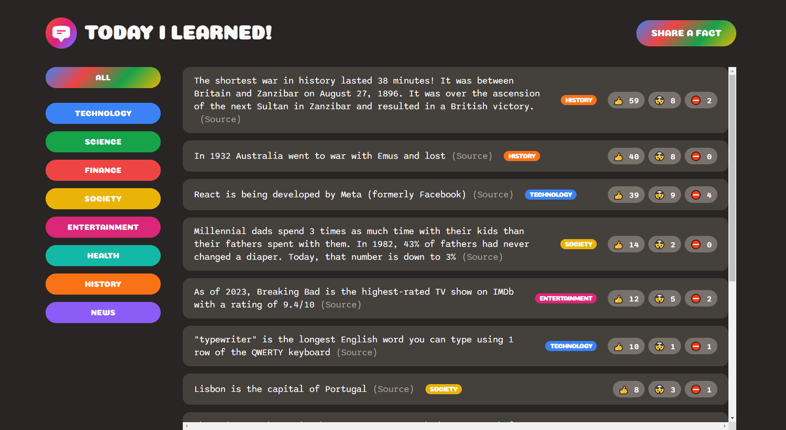
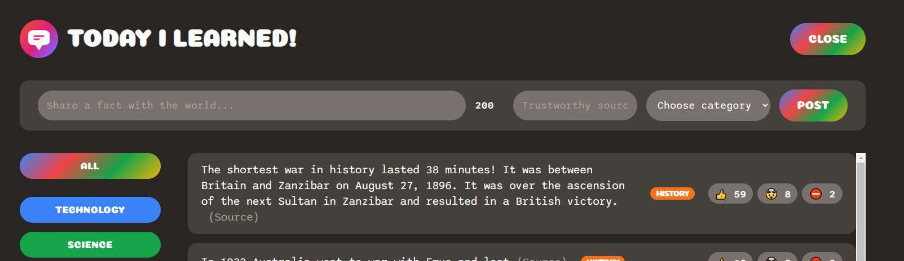

# Today I Learned

## Overview

Today I Learned is a full-stack web application that allows users to add to an existing database of facts, sorted by category. The facts must use a reliable source that is shared with the fact and users can dispute a fact by voting false under the fact, which will be reviewed by the administrator. Users can also vote for the fact being "interesting" and "mind-blowing".

Current categories include:

- Technology
- Science
- Finance
- Society
- Entertainment
- Health
- History
- News

## Hosting

This site is currently hosted by Netlify.

## Live Site

The site can be currently accessed [here](https://today-i-learned-caitlin-malloch.netlify.app/)
https://today-i-learned-caitlin-malloch.netlify.app/

## UI Preview

Screen with current facts in database. The left hand side is the sorting filters, by category.

There is also a form that can be opened by pressing the button at the top right of the screen. Once the form opens, users can enter a new fact.

## Tech Stack

- HTML
- CSS
- JavaScript
- React
- Node.js
- Backend supported by [Supabase](https://supabase.com/)

## Developer

Caitlin Malloch

## License

MIT License

Copyright (c) 2023 Caitlin Malloch

Permission is hereby granted, free of charge, to any person obtaining a copy of this software and associated documentation files (the "Software"), to deal in the Software without restriction, including without limitation the rights to use, copy, modify, merge, publish, distribute, sublicense, and/or sell copies of the Software, and to permit persons to whom the Software is furnished to do so, subject to the following conditions:

The above copyright notice and this permission notice shall be included in all copies or substantial portions of the Software.

THE SOFTWARE IS PROVIDED "AS IS", WITHOUT WARRANTY OF ANY KIND, EXPRESS OR IMPLIED, INCLUDING BUT NOT LIMITED TO THE WARRANTIES OF MERCHANTABILITY, FITNESS FOR A PARTICULAR PURPOSE AND NONINFRINGEMENT. IN NO EVENT SHALL THE AUTHORS OR COPYRIGHT HOLDERS BE LIABLE FOR ANY CLAIM, DAMAGES OR OTHER LIABILITY, WHETHER IN AN ACTION OF CONTRACT, TORT OR OTHERWISE, ARISING FROM, OUT OF OR IN CONNECTION WITH THE SOFTWARE OR THE USE OR OTHER DEALINGS IN THE SOFTWARE.

## Acknowledgements

Crash Course: Build a Full-Stack Web App in a Weekend!, 2023
Udemy author: Jonas Schmedtmann
